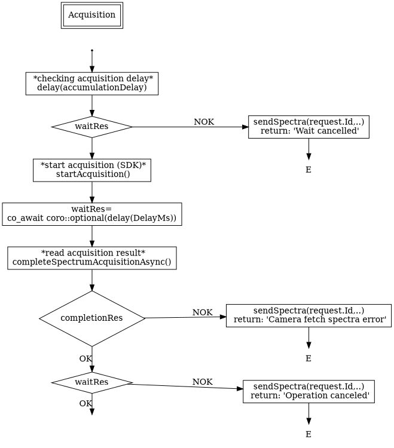

```graphviz {#id .class width=800px}
digraph {
    rankdir=LR;
    size="8,5" // "width,height"
    node [shape = box]; // default node shape

    Title[peripheries=2,label="Acquisition"]
    Title->S[arrowhead=none,penwidth=0]

    S [shape=point, label = "",penwidth=0];
    S -> M510  

    M510  [ label = " *checking acquisition delay*\ndelay(accumulationDelay)"];
    
    
    M510 -> M200;
    M200 [ shape="diamond", label = "waitRes"];

    M200 -> E100m [ label = "NOK" ];
        E100m [ label = "sendSpectra(request.Id,..)\n return: 'Wait cancelled'"];
        E100m -> E100n
        E100n [ label = "E", penwidth=0];

    /* start acquisition delay*/

    M610  [ label = " *start acquisition (SDK)*\n startAcquisition()"];
    M200 -> M610;
    M610 -> M280[label = ""];
    

    // delay

    M280 [label = "waitRes=\nco_await coro::optional(delay(DelayMs))"];
    
    /* read acquisition resultn */

    M710  [ label = " *read acquisition result*\ncompleteSpectrumAcquisitionAsync()"];
    M280 -> M710;
    M710 -> M240
    M240 [ shape="diamond", height =1.3, width=1.3, label = "completionRes"];

    M240 -> E100o [ label = "NOK " ];
        E100o [ label = "sendSpectra(request.Id,..)\n return: 'Camera fetch spectra error'"];
        E100o -> E100p
        E100p [ label = "E", penwidth=0];

    M290 [ shape="diamond", label = "waitRes"];
    M240-> M290[label="OK"];

    M290 -> E100q [ label = "NOK " ];
        E100q [ label = "sendSpectra(request.Id,..)\n return: 'Operation canceled'"];
        E100q -> E100r
        E100r [ label = "E", penwidth=0];

    M290-> M300[label="OK"]
    M300[label="", penwidth=0]

    {rank=same Title S M200 M240 M280 M290 M300 M510 M610 M710 }
    {rank=same E100m E100n E100o E100p E100q E100r}

}
```