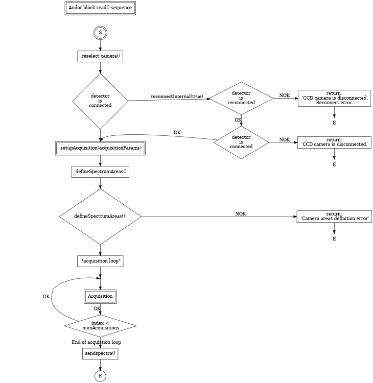

```graphviz {#id .class width=800px}
digraph {
    rankdir=LR;
    size="8,5" // "width,height"
    node [shape = box]; // default node shape

    Title[peripheries=2,label="Andor block read() sequence"]
    Title->S[arrowhead=none,penwidth=0]

    S [shape = doublecircle, label = "S"];
    S -> M110  

    /* check connection and reconnection */

    M110 [ label = " reselect camera()"];
    M110 -> M120 
    M120 [ shape="diamond", height =02.5, width=2.5, label = "detector\nis\nconnected"];

    M120 -> E100a [ label = "reconnectInternal(true)" ];
        E100a [ shape="diamond",label = "detector\nis\nreconnected"];
        E100a -> E100b [ label = "NOK " ];
        E100b [ label = "return:\n 'CCD camera is disconnected.\n Reconnect error.'"];
        E100b -> E100c
        E100c [ label = "E", penwidth=0];

    E100a -> E100d [ label = "OK" ];
    E100d [ shape="diamond", label = "detector\nis\nconnected"];
    E100d -> E100e [ label = "NOK " ];
        E100e [ label = "return:\n 'CCD camera is disconnected.'"];
        E100e -> E100f
        E100f [ label = "E", penwidth=0];

    E100d -> M210 [label = "OK",headport=n];
    
    /* setup acquisition */

    M210  [ peripheries=2,label = " setupAcquisition(acquisitionParams)"];
    M120->M210
    
    M210->M310

    /* defineSpectrumAreas */

    M310  [ label = " defineSpectrumAreas()"];
    //M140c -> M310;
    M310 -> M160
    M160 [ shape="diamond", height =02.5, width=2.5, label = "defineSpectrumAreas():"];


    M160 -> E100i [ label = "NOK " ];
        E100i [ label = "return:\n 'Camera areas definition error'"];
        E100i -> E100j
        E100j [ label = "E", penwidth=0];

    /* start acquisition loop*/

    M410  [ label = " *acquisition loop*"];
    M160 -> M410;
    M410 -> M180;
    M180 [ shape="point"];
    
    M180->M290
    M290[peripheries=2,label="Acquisition"]
    // end of loop test

    M290 -> M260[label="OK"];
    M260 [ shape="diamond", height=1, width=1, label = "index <\n numAcquisitions"];

    //M260->M180[ label = "OK " ];
    M180->M260[label="OK",dir=back]

    E [shape = circle, label = "E"];
    M260 -> M270[ label = "End of acquistion loop " ];

    M270 [label = "sendspectra()"];
    M270 -> E;


    

    { rank=same Title S M110 M120 M210  M310 M160 M410 M180 M260 M270 M290 E }
    { rank=same  E100a E100d }
    { rank=same  E100b E100c E100e E100f E100i E100j}

    //{rank=same;M14 E10g1}

}

```

