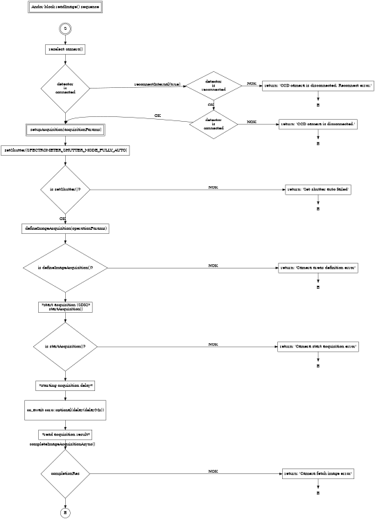

```graphviz {#id .class width=800px}
digraph {
    rankdir=LR;
    size="8,5" // "width,height"
    node [shape = box]; // default node shape

    Title[peripheries=2,label="Andor block readImage() sequence"]
    Title->S[arrowhead=none,penwidth=0]


    S [shape = doublecircle, label = "S"];
    S -> M11 

    /* check connection and reconnection */

    M11 [ label = " reselect camera()"];
    M11 -> M12 
    M12 [ shape="diamond", height =02.5, width=2.5, label = "detector\nis\nconnected"];

    M12 -> E10a [ label = "reconnectInternal(true)" ];
        E10a [ shape="diamond",label = "detector\nis\nreconnected"];

        E10a -> E10b [ label = "NOK " ];
        E10b [ label = "return: 'CCD camera is disconnected. Reconnect error.'"];
           E10b -> E10c
           E10c [ label = "E", penwidth=0];

    E10a -> E10d [ label = "OK" ];
        E10d [ shape="diamond", label = "detector\nis\nconnected"];
        E10d -> E10e [ label = "NOK " ];
            E10e [ label = "return: 'CCD camera is disconnected.'"];
            E10e -> E10f
            E10f [ label = "E", penwidth=0];

    E10d -> M21 [label = "OK",headport=n];
    
    /* setup acquisition */

    M21  [ peripheries=2,label = " setupAcquisition(acquisitionParams)"];
    M12 -> M21

    M21->M31

    /* set shutter */

    M31  [ label = " setShutter(SPECTROMETER_SHUTTER_MODE_FULLY_AUTO)"];
 
    M31 -> M16
    M16 [ shape="diamond", height =02.5, width=2.5, label = "is setShutter()?"];


    M16 -> E10i [ label = "NOK " ];
        E10i [ label = "return: 'Set shutter auto failed'"];
        E10i -> E10j
        E10j [ label = "E", penwidth=0];

    /* define Image acquisition */

    M41  [ label = " defineImageAcquisition(operationParams)"];
    M16 -> M41[label="OK"];
    M41 -> M18//[label = "defineImageAcquisition()"];
    M18 [ shape="diamond", height =02.5, width=2.5, label = "is defineImageAcquisition()?"];


    M18 -> E10k [ label = "NOK " ];
        E10k [ label = "return: 'Camera areas definition error'"];
        E10k -> E10l
        E10l [ label = "E", penwidth=0];

    /* start acquisition */

    M51  [ label = " *start acquisition (SDK)*\n startAcquisition()"];
    M18 -> M51;
    M51 -> M20//[label = "startAcquisition()"];
    M20 [ shape="diamond", height =02.5, width=2.5, label = "is startAcquisition()?"];


    M20 -> E10m [ label = "NOK " ];
        E10m [ label = "return: 'Camera start acquisition error'"];
        E10m -> E10n
        E10n [ label = "E", penwidth=0];

    /* start acquisition delay*/

    M61  [ label = " *starting acquisition delay*"];
    M20 -> M61;
    M61 -> M22//[label = "co_await coro::optional(delay(delayMs))"];
    M22 [  height =1.0, width=2.5, label = "co_await coro::optional(delay(delayMs))"];

    /* read acquisition resultn */

    M71  [ label = " *read acquisition result*"];
    M22 -> M71;
    M71 -> M24[label = "completeImageAcquisitionAsync()"];
    M24 [ shape="diamond", height =02.5, width=2.5, label = "completionRes"];


    M24 -> E10o [ label = "NOK " ];
        E10o [ label = "return: 'Camera fetch image error'"];
        E10o -> E10p
        E10p [ label = "E", penwidth=0];


    E [shape = circle, label = "E"];
    M24 -> E
    

    { rank=same Title S M11 M12 M21 M31 M16 M41 M18 M51 M20 M61 M22 M71 M24 E }
    { rank=same  E10a E10d}
    { rank=same  E10b E10c E10e  E10f E10i E10j E10k E10l E10m E10n E10o E10p}

    //{rank=same;M14 E10g1}

}

```