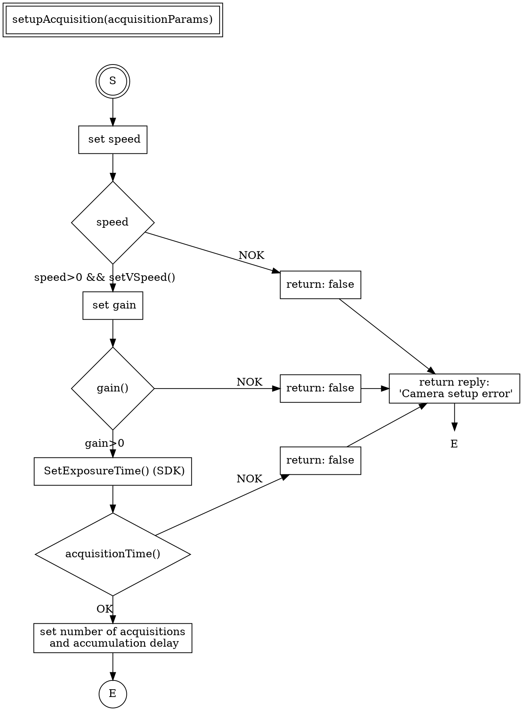

```graphviz {#id .class width=800px}
digraph {
    rankdir=LR;
    size=",5" // "width,height"
    node [shape = box]; // default node shape

    Title[peripheries=2,label="setupAcquisition(acquisitionParams)"]

    Title->S[arrowhead=none,penwidth=0]

    S [shape = doublecircle, label = "S"];
    S -> M130b  


    /* speed */
    M130b  [ label = " set speed"];
    //M110 -> M130b 
    M130b-> M140[];
    M140 [ shape="diamond", height =1.5, width=1.5, label = "speed"];

    M140 -> E100g1 [ label = "NOK"];
    E100g1 [ label = "return: false"];
    E100g1 -> E100g 
    

    /* gain */
    M130c  [ label = " set gain"];
    M140 -> M130c[label="speed>0 && setVSpeed()"]
    M130c-> M140b
    M140b [ shape="diamond", height =1.5, width=1.5, label = "gain()"];

    M140b -> E100g2 [ label = "NOK " ];
    E100g2 [ label = "return: false"];
    E100g2 -> E100g 
    

    /* exposure time */
    M130d  [ label = " SetExposureTime() (SDK)"];
    M140b -> M130d[label="gain>0"]
    M130d-> M140c
    M140c [ shape="diamond", height =1.5, width=1.5, label = "acquisitionTime()"];

    M140c -> E100g3 [ label = "NOK " ];
    E100g3 [ label = "return: false"];
    

    E100g3 -> E100g 
    E100g [ label = "return reply:\n 'Camera setup error'"];
    E100g -> E100h 
    E100h [ label = "E", penwidth=0];

    M140c -> M200[label="OK"]
    M200[label="set number of acquisitions\n and accumulation delay"]

    M200->M300

    M300[shape=circle,label="E"]


    {rank=same Title S M130b M130c M130d M140 M140b M140c M200 M300}
    {rank=same E100g1 E100g2 E100g3}
    {rank=same E100g E100h}


}
```