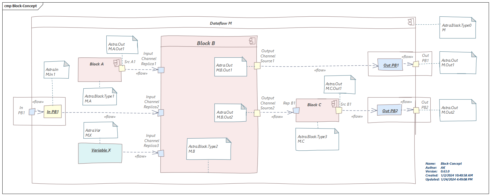

# ASTRA Platform Blocks - Conception
The conception of the platform block

## Astra MiddleWare Terms
- **Instance** - a concept of uniquely identified communication object. ID: **Type Name** + **Instance Name**
- **Entity** - JSON data object published by **Instance**
- **Source** - program object publishing **Instance** JSON data entity and replying incoming requests
- **Replica** - program object giving remote access to the **Source** notifying its data changes, delivering application requests and replies. 
- **Proxy** - programs object **Replica** and **Source** transparently delivering data from **Replica** to **Source**, requests from **Source** to **Replica** and replies back from **Replica** to **Source**
- **Factory** - special **Instance** creating and deleting **Instances** automatically of certain **Type Name** by presence of strong **Replicas** (as opposed to weak **Replica**).

## Blocks Conception
- System consists of **Blocks** 
- **Block** has input **Channles** and output **Channles** 
- **Dataflow** is a complex **Block** containing other **Blocks** 
- **Dataflow** uses **Variables** to store its parameters
- **Dataflow** has input **Pins** to define its external input **Channels** 
- **Dataflow** has output **Pins** to define its external output **Channels**  
- Input **Channel** or output **Pin** may be connected to get data from output **Channel**, input **Pin** or **Variable**

## Blocks Implementation in Astra MiddleWare
- **Block** is provided as **Source** of **Block** **Entity**
- **Block** is created/deleted by its **Factory**.
- **Block** creates **Sources** of **Channel** **Entity** for its output **Channels**
- **Block** creates weak **Replicas** of **Channel** **Entity** for its input **Channels**
- **Dataflow** creates **Proxies** for its input and output **Pins**
- **Dataflow** creates strong **Replicas** of **Channel** **Entity** for its **Variables**
- **Variables** are created/deleted by **Factory** in file storage.

## Naming Rules
| Type Name | Instance Name | Naming Rule | | |
|---|---|--:|---|:---|
| Astra.Block.Xxx | **Block** | Parent **Dataflow** **Instance** name | . | **Block** name in the **Dataflow** |
| Astra.Out | **Output** channel | Parent **Block** **Instance** name | . |**Output** name in the **Block** |
| Astra.In | Input **Pin** **Proxy** source | Parent **Dataflow** **Instance** name | . | Input **Pin** name in the **Dataflow** |
| Astra.Var | **Variable** | Parent **Dataflow** **Instance** name | . | **Variable** name in the **Dataflow** |

- Type names segments use Pascal case: **Astra.Block.DemoOne**
- Instance names segments use Camelcase: **main.routine.partTwo**

## Block Design

