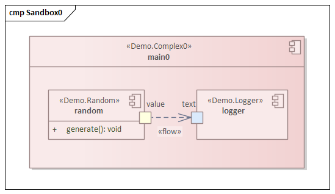
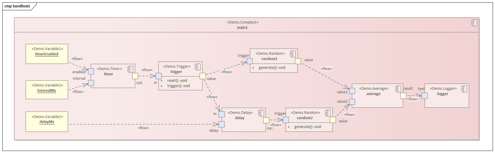
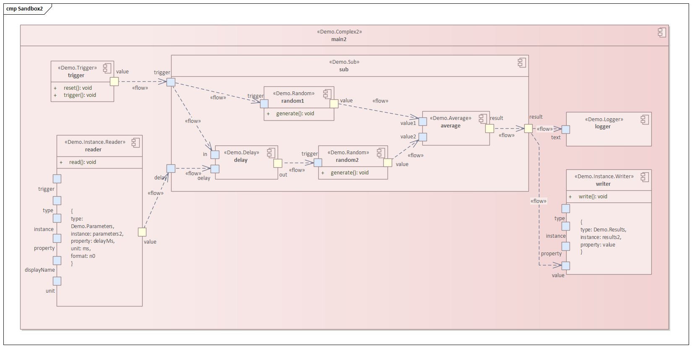
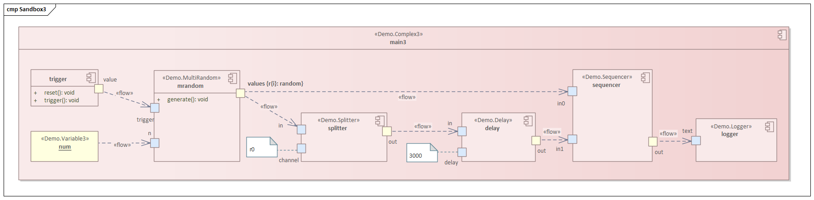
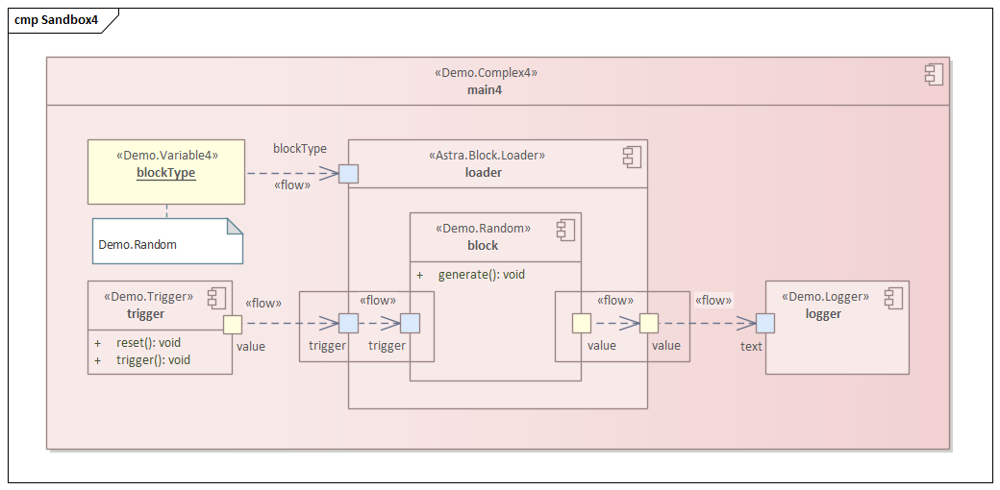
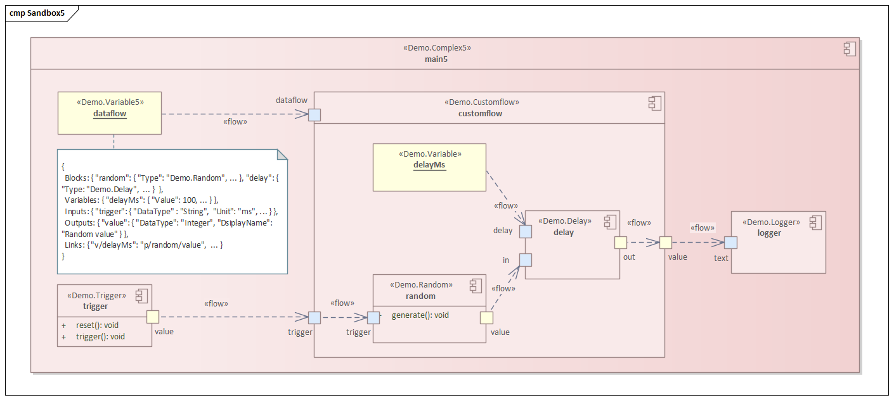
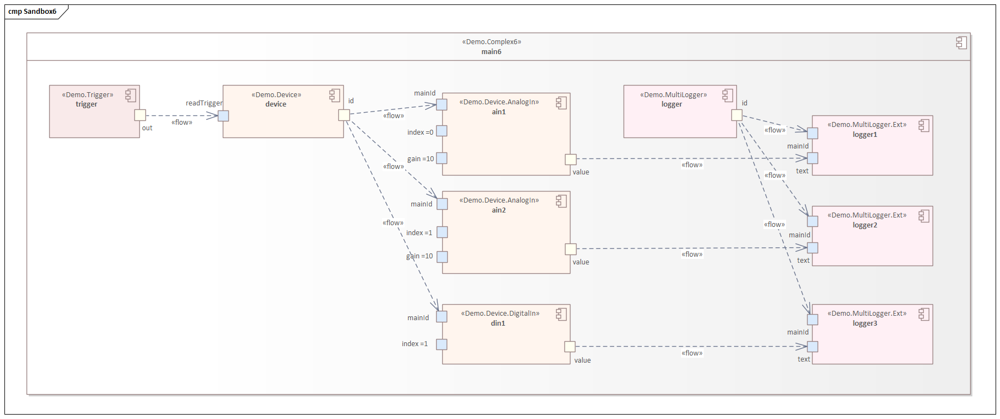

# ASTRA Platform Blocks - Examples
The app examples

## Sandbox 0 - Trivial dataflow

## Sandbox 1 - Variables and synchronization

## Sandbox 2 - Nested dataflows

## Sandbox 3 - Channel groups

## Sandbox 4 - Dynamic loading

## Sandbox 5 - Dynamic dataflow
User can edit dataflow content.

## Sandbox 6 - Extensions
Main block - extension blocks

