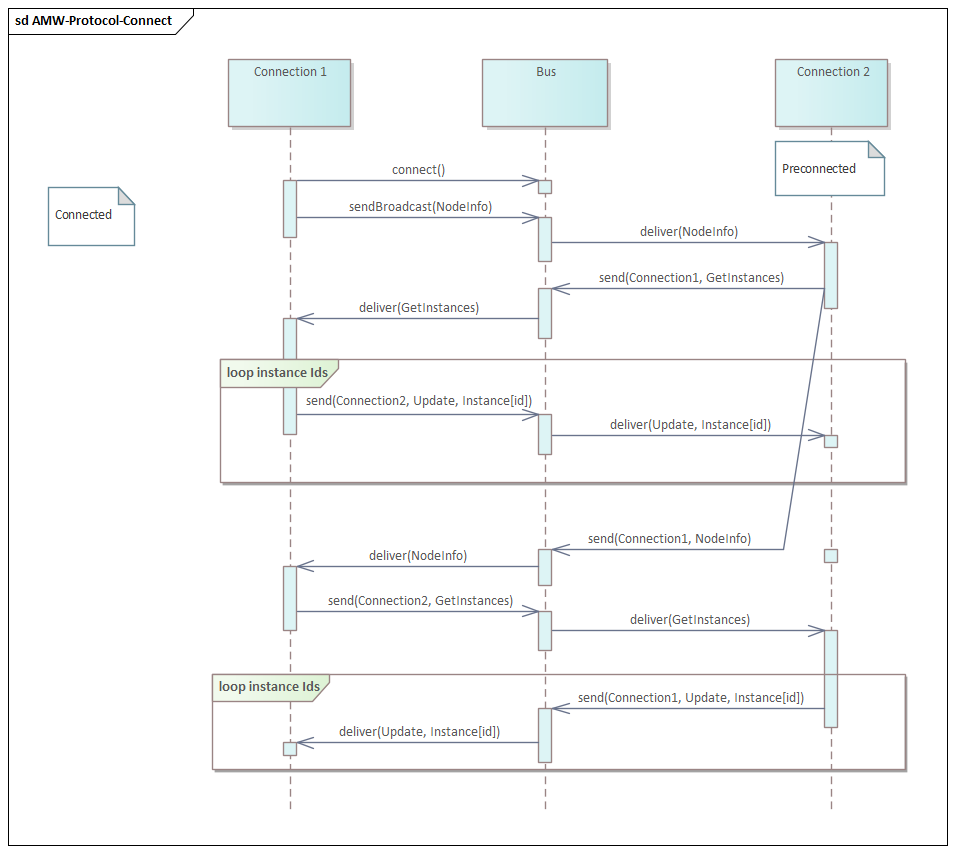
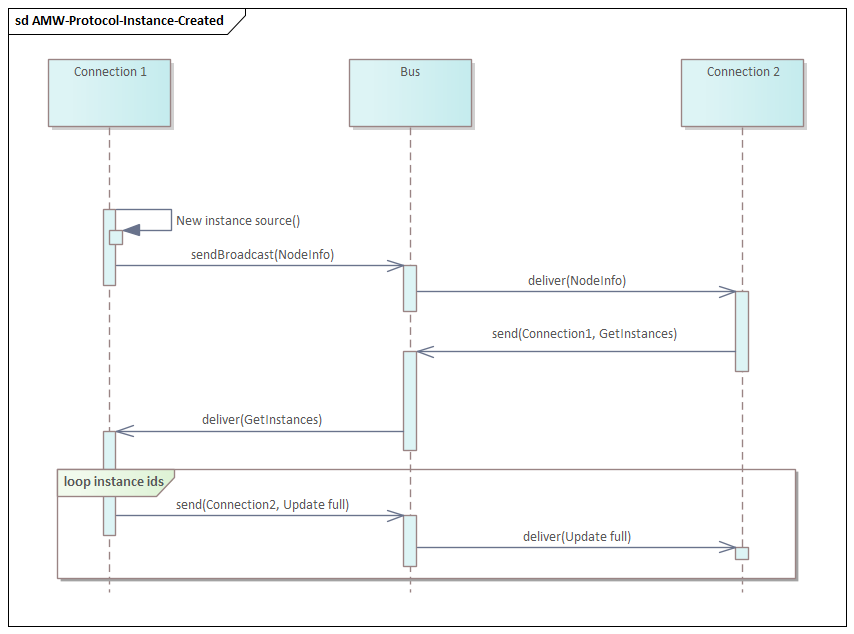
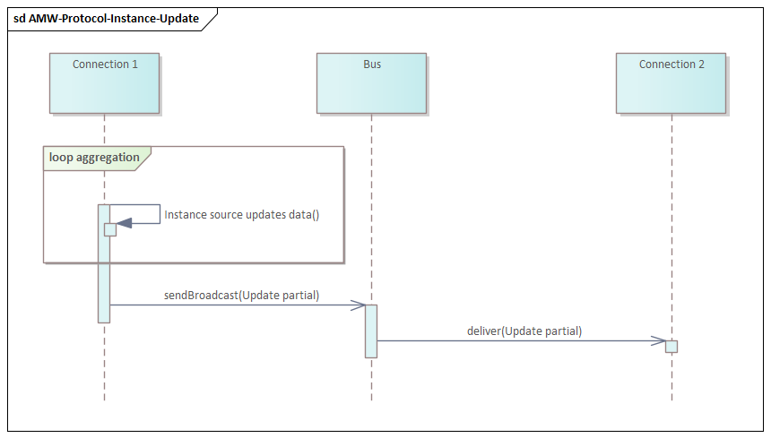
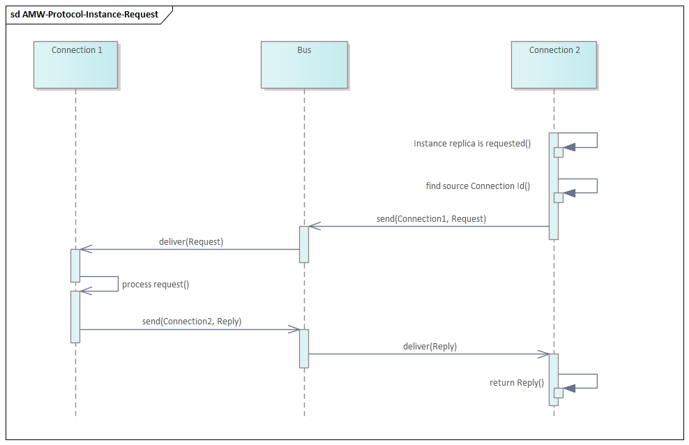

# ASTRA Platform MiddleWare - Bus Protocol
Specification of the message exchange protocol over AWM message bus.

* Version: 1.0.0
* State: draft

## Description
Middleware **Bus** provides is based on the following communication principles.
1. **Bus** guarantees message delivery.
2. Each **Connection** has unique non-empty **ID**
3. **Connection** can send and receive **Frames** (messages)
4. **Frame** can be sent directly to **Connection** by destination **ID**
5. **Frame** can be broadcasted to all connections using empty destination **ID**
6. The payload of one **Frame** delivers one message.
7. **Connections** use periodic heartbeat broadcasts to keep other nodes aware of all **Connections** 

## Frame
**Frame** is a single package of information to send/receive over the **Bus**.

| # | Field | Type | Description |
| --- | --- | --- | --- |
| 1 | ID | string | Unique **ID** |
| 2 | SID | string | Source **Connection** **ID** |
| 3 | DID | string | Destination **Connection** **ID**. Empty for broadcast **Frames** |
| 4 | MT | string | Message type. See list of messages below |
| 5 | DT | JSON | Message (frame payload). See list of messages below |

## Messages
List of messages.

| # | Message Type | Description | Payload | Direct | Broadcast | Aggregatable |
| --- | --- | --- | --- | --- | --- | --- |
| 0 | Empty | Empty message |  | + | + | + |
| 1 | Update | Full or partial instance data | AstraInstanceTransaction | + | + | + |
| 2 | Request | Request to instance source | AstraRequest | + | - | - |
| 3 | Reply | Reply from instance source | AstraReply | + | - | - |
| 4 | Get | Request node for instances data | AstraGetInstances | + | + | + |
| 5 | Node | Node information | AstraNodeInfo | + | + | + |

### Message: Empty
No payload

### Message: Update
Message contains single transaction to modify instance data.

| Field | Subfield | Description | Datatype | Values | Mandatory |
| --- | --- | --- | --- | --- | --- |
| Id |  | Destination instance or instance item ID | AstraInstanceItemId |  | + |
|  | T | Destination instance type | string |  | + |
|  | N | Destination instance name | string |  | + |
|  | I | Destination instance item name | string |  |  |
| Mode |  | Transaction application mode | string |  |  |
|  |  | Empty transation: do not change the instance |  | **Keep** | + |  |
|  |  | Replace instance data completely with transaction data | | Replace |  |
|  |  | Merge in transaction data into the instance data |  | Merge |  |
|  |  | Clear instance data | | Delete |  |
| Data |  | JSON data to apply | JSON |  |  |

Example:
```json
{
    "Id": { "T": "Demo.Type", "N": "main", "I": "part1" },
    "Mode": "Merge",
    "Data": { "Delay": 120 }
}
```

### Message: Request
Request from replica to its source.

| Field | Subfield | Description | Datatype | Values | Mandatory |
| --- | --- | --- | --- | --- | --- |
| IId |  | Destination instance ID | AstraInstanceId |  | + |
|  | T | Instance type | string |  | + |
|  | N | Instance name | string |  | + |
| Id |  | Request ID. Source will reply it back | string |  |  |
| Name |  | Request name | string |  | + |
| Data |  | Request data payload | JSON |  |  |

Example:
```json
{
    "IId": { "T": "Demo.Random", "N": "generator" },
    "Id": "c7fcf582b9a34c3fb55f3e34e268ecd7",
    "Name": "generate"
    "Data": { "Distribution": "normal" }
}
```

### Message: Reply
Reply from source to requesting replica.

| Field | Subfield | Subfield | Description | Datatype | Values | Mandatory |
| --- | --- | --- | --- | --- | --- | --- |
| IId |  |  | Replier instance ID | AstraInstanceId |  | + |
|  | T |  | Instance type | string |  | + |
|  | N |  | instance name | string |  | + |
| Id |  |  | Original request ID | string |  |  |
| Name |  |  | Request name | string |  | + |
| Data |  |  | Reply data payload | JSON |  |  |
| Ok |  |  | A value indicating whether request completed successfully | boolean |  |  |
| Results |  |  | Array of results of the request | AstraResult[] |  |  |
|  | Source |  | Result source name | string |  |  |
|  | Code |  | Result error code | integer |  |  |
|  | Severity |  | Result severity level | string |  |  |
|  |  |  | Information |  | **Information** |  |
|  |  |  | Warning |  | Warning |  |
|  |  |  | Error |  | Error |  |
|  | Message |  | Text message | AstraText |  |  |
|  |  | Template | Message template. It may include %1, %2 and etc placeholders for parameters | string |  |  |
|  |  | Parameters | Message parameters | JSON array  |  |  |

Example:
```json
{
    "IId": { "T": "Demo.Random", "N": "generator" },
    "Id": "c7fcf582b9a34c3fb55f3e34e268ecd7",
    "Name": "generate"
    "Data": { "Distribution": "normal" },
    "Ok": true
    "Results": {
        {
            "Source": "GEN",
            "Code": 0,
            "Severity": "Information",
            "Message":
            {
                "Template": "Seed %1",
                "Parameters": [ 123 ]
            }
        }
    }
}
```

### Message: Get
Request node for instances data.

| Field | Subfield | Description | Datatype | Values | Mandatory |
| --- | --- | --- | --- | --- | --- |
| Ids |  | Array of instance IDs to get | AstraInstanceId[] |  |  |
|  | T | Instance type | string |  | + |
|  | N | Instance name | string |  | + |

Example:
```json
{
    "Ids": [
        { "T": "Demo.Random", "N": "generator" },
        { "T": "Demo.Logger", "N": "console" }
    ]
}
```

### Message: Node
Node information.

| Field | Subfield | Subfield | Description | Datatype | Values | Mandatory |
| --- | --- | --- | --- | --- | --- | --- |
| AddInstances |  |  | Array of instance IDs the node has added | AstraInstanceInfo[] |  |  |
|  | Id |  | Instance Id | string |  | + |
|  |  | T |  Instance type | string |  | + |
|  |  | N |  Instance name | string |  | + |
|  | NumSource |  | Number of sources of the instance | integer |  |  |
|  | NumReplicas |  | Total number of replicas of the instance | integer |  |  |
|  | NumStrongReplicas |  | Number of replicas of the instance demanding to create instance source | integer |  |  |
| RemoveInstances |  |  |  Array of instance IDs the node has removed | AstraInstanceId[] |  |  |
|  | T |  |  Instance type | string |  | + |
|  | N |  |  Instance name | string |  | + |

Example:
```json
{
    "AddInstances": [
        {
            "Id": { "T": "Demo.Random", "N": "generator" },
            "NumSource": 1,
            "NumReplicas": 2,
            "NumStrongReplicas": 0
        }
        {
            "Id": { "T": "Demo.Logger", "N": "console" },
            "NumSource": 0,
            "NumReplicas": 0,
            "NumStrongReplicas": 1
        }
    ]
    "RemoveInstances": [
        { "T": "Demo.Writer", "N": "file1" },
        { "T": "Demo.Writer", "N": "file2" }
    ]
}
```

## Connection discovery
* **Connection** is considered as available for communication on receiving any message from it.

* Each **Connection** sends broadcast message as indicator of its availability for communication.

* If no useful message is sent during heartbead interval of *1000 ms* then Empty message is broadcasted.

* If no message was received from **Connection** in *3 x hearbeat intervals* then it becomes considered as unavailable for communication.

## Sequences
Description of the principal sequences.

### Sequence: Connected


### Sequence: Instance Created


### Sequence: Instance Deleted


### Sequence: Instance Update


### Sequence: Instance Request
