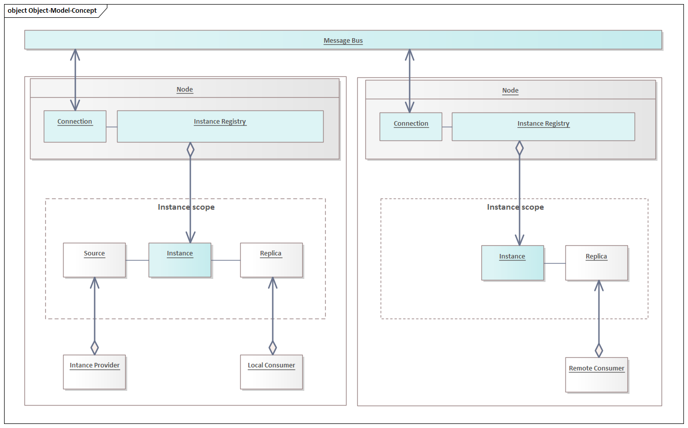
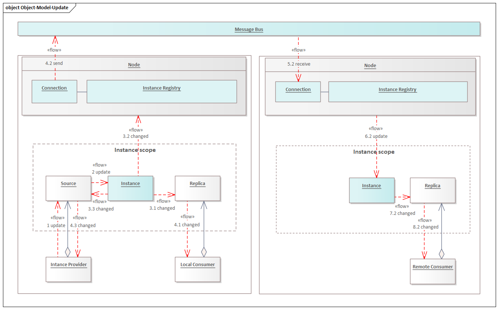
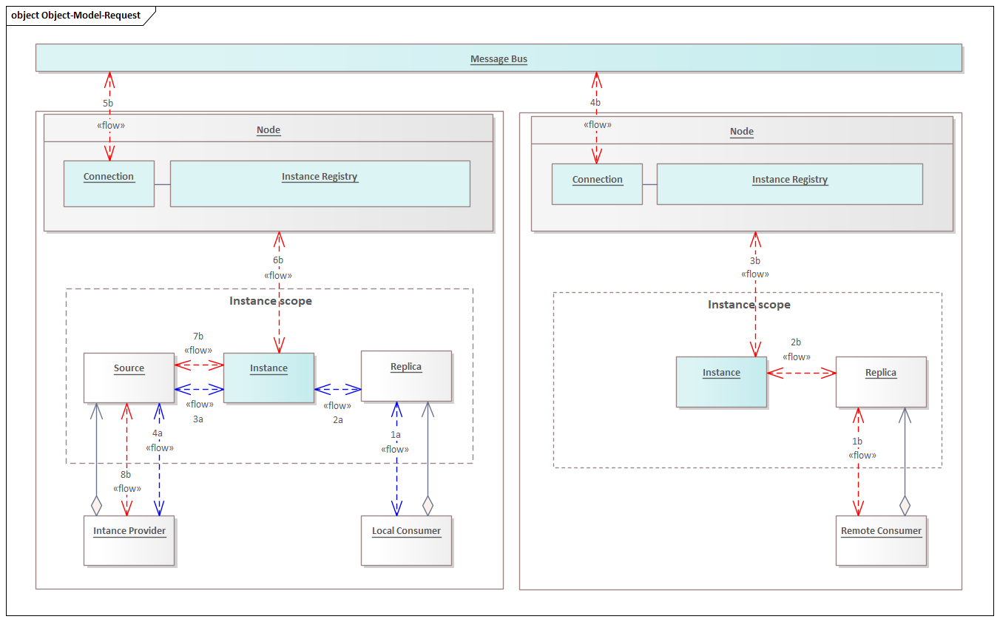

# ASTRA Platform MiddleWare - Conception
The conception of the communication and use-cases.

## Conception
- System consists of **Nodes** communicating over **Message Bus**
- **Instance** is the elementary unit of information to share. 
- **Instance** is identified by *ResourceType/Name* pair of strings. 
- **Instance** contains application data (serializable object entity). 
- Application code creates **Instance Source** registering it on its **Node** to act on behalf of the **Instance** as provider.
- Application code creates **Instance Replica** registering it on its **Node** to get access to the **Instance**.

## Instance Update
- Application calls **Instance Source** to change its content.
- Content changes are propagated automatically to all **Instance Replicas** and therefore to its application consumers.

## Instance Request
- Application consumer calls **Instance Replica** to issue requests over to **Instance Source**.
- Application providers receives incoming requests through **Instance Source**, process its and then replies back.
- MiddleWare delivers reply back from **Instance Source** to **Instance Replica** and then to consumer.

