[//]: # (           Copyright ©2022-2025 - HORIBA France S.A.S.                          )
[//]: # (       PROPRIETARY AND CONFIDENTIAL - All Rights Reserved                       )
[//]: # (                                                                                )
[//]: # (                                                                                )
[//]: # ( This program - the “Program” - is part of a HORIBA France SAS project. The     )
[//]: # ( Program - along with all its information - is strictly confidential and        )
[//]: # ( remains the exclusive ownership of HORIBA France S.A.S. This Program is        )
[//]: # ( protected under international copyright laws and treaties.                     )
[//]: # ( Any use, reproduction, or distribution of this Program or of any portion of    )
[//]: # ( it without the express written authorization from HORIBA France S.A.S. or      )
[//]: # ( its authorized representatives is strictly prohibited. Unauthorized actions    )
[//]: # ( may result in severe civil and criminal penalties and will be prosecuted to    )
[//]: # ( the maximum extent permitted by law.                                           )
[//]: # ( Unless otherwise expressly agreed in writing with HORIBA France S.A.S., the    )
[//]: # ( authorization to use the Program is governed by the terms of                   )
[//]: # ( HORIBA France S.A.S’ license agreement - the “LICENSE Agreement” -. You should )
[//]: # ( have received a copy of the LICENSE Agreement with the Program. If not,        )
[//]: # ( please contact HORIBA France S.A.S. to obtain a copy.                          )
[//]: # ( If you have received this Program without authorization, please notify         )
[//]: # ( HORIBA France S.A.S. immediately.                                              )
# OPCUA Module implementation details
<!-- markdownlint-disable-file MD046 Fenced blocks used throughout document -->

[overview](./Overview.md) {.include}

## Process

### Main sequence

The system provides a converter and manager for an OPCUA server (open62541 based), and encapsulates it in a separate thread to avoid blocking the Astra system.

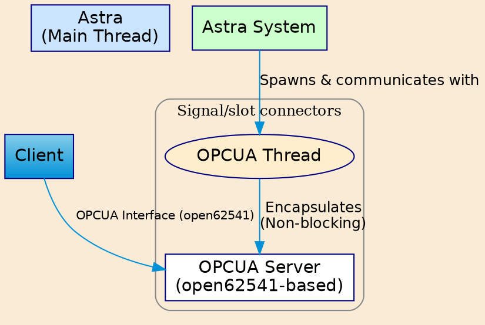

<!-- /newpage -->

##### Class diagram Worker

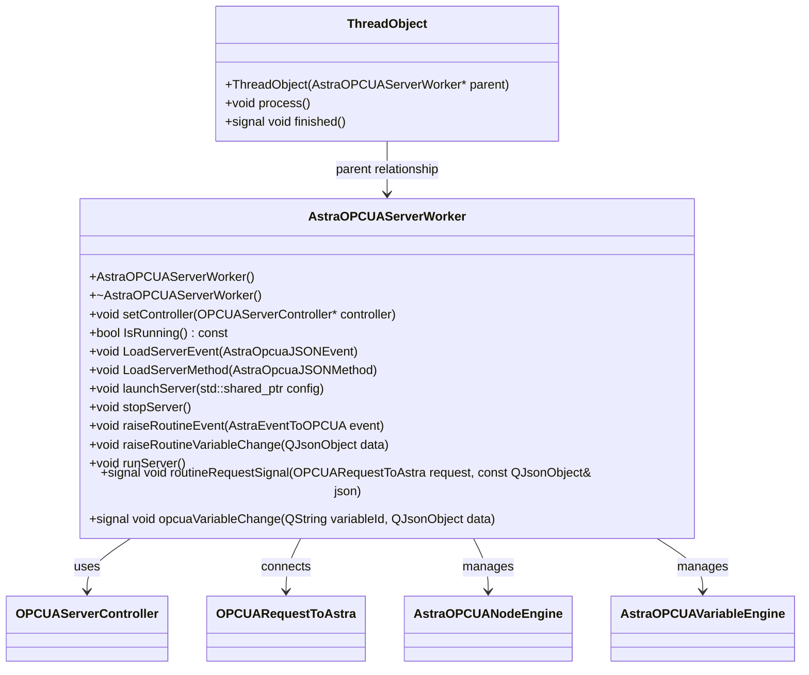

[↩️](#main-classes)

---

#### Server Worker

This class is both the most important and relatively simple conceptually.

The Worker is a `QObject`. It is hosted in a ThreadObject, which is merely a `QObject` with a _process_ slot and a _finished_ signal.
The process method asks the Worker to run the server. When the server stops running, the finished signal is emitted.

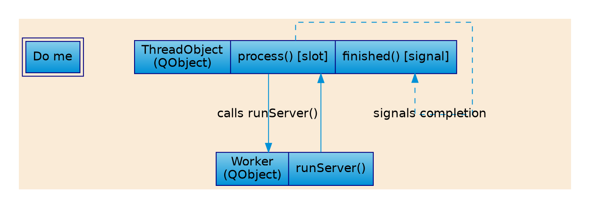

##### Worker logic

The class diagram shows the handles: set the controller with `setController`, communicate demands for routines and variables via `raiseRoutineEvent` and `raiseRoutineEvent`, track Astra variable changes via the signal òpcuaVariableChange`.
When Astra responds to a routine call, it uses the signal raiseRoutineVariableChange`.

Two important notes: the OPCUA server runs once launched via `runServer()`and until stopped via `stopServer()` (or an emergency stop), as reflected in the `IsRunning()` method. It currently loads its config via the launchServer method, which reads the config as a JSON file (that will later be passed via an Astra pin).

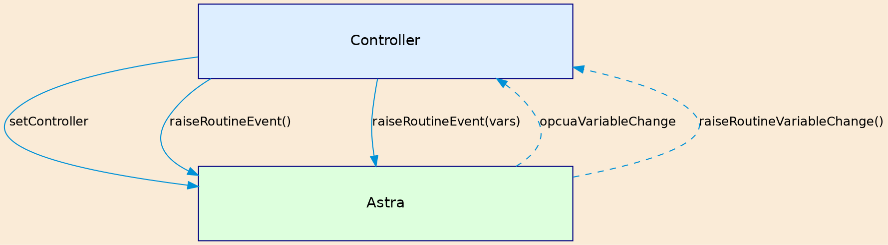

##### Class Diagram Worker

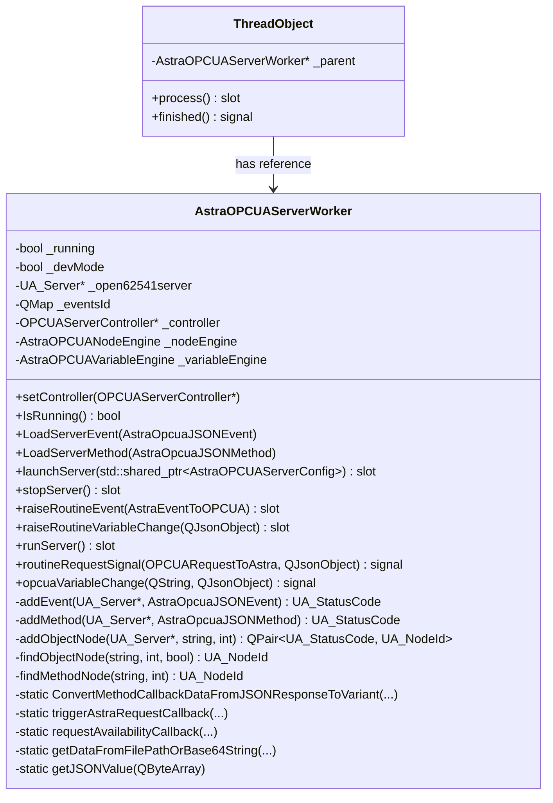

[↩️](#main-classes)

---

### Astra OPCUA module

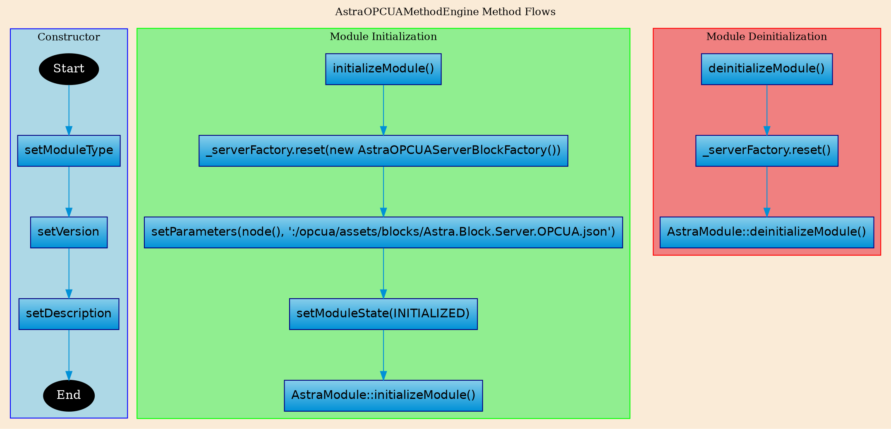

##### Class Diagram OPCUA Module

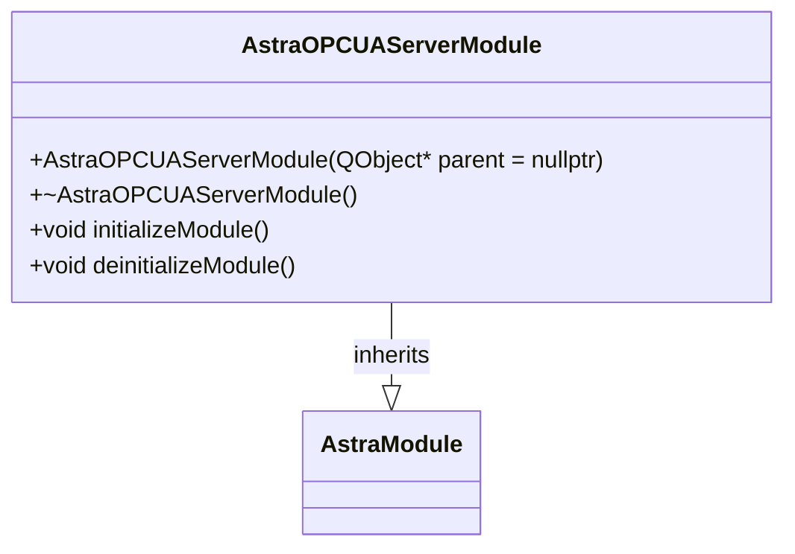

[↩️](#main-classes)

---

##### Astra OPCUA Block

The block connects replicas from Astra and the controller managing the OPCUA Worker thread.
It relies on connecting signals and replicas with the methods shown in the class diagram beneath.

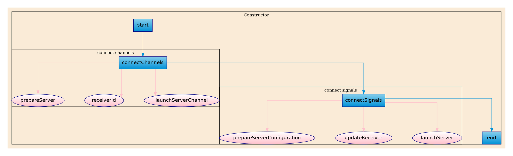

##### Class Diagram OPCUA Block

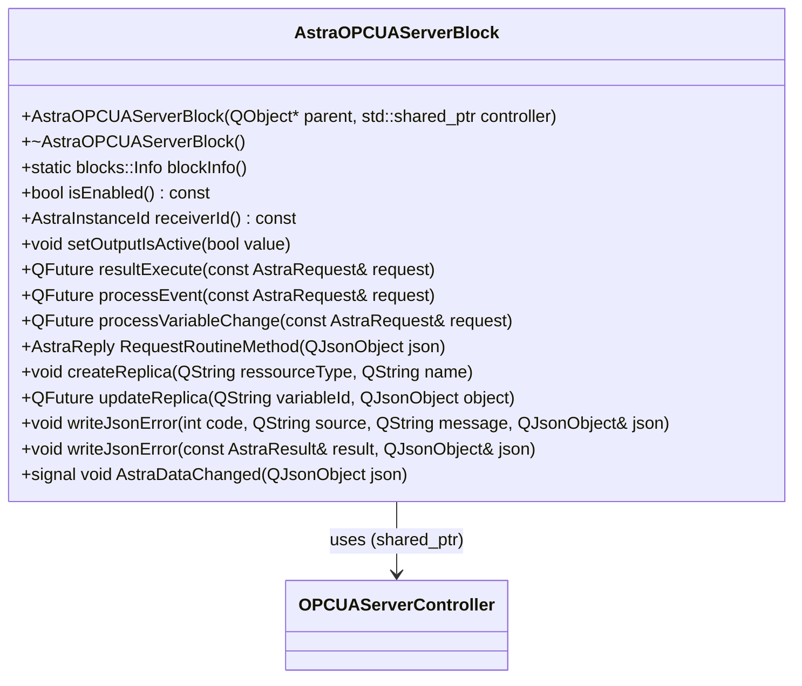

[↩️](#main-classes)

---

#### Astra OPCUA Controller

```graphviz {#id .class width=600px}
digraph OPCUAServerController {
        // Global graph styling
    graph [
        bgcolor="antiquewhite",

        fontsize=12,
        labelloc="t",
        labeljust="c"
    ];

    // Node styling
    node [
        shape=box,
        style=filled,
        fillcolor="skyblue:#0091D7",
        gradientangle=270,
        fontname="Helvetica",
        fontcolor="black",
        color=navyblue
    ];

    // Edge styling
    edge [
        color="#0091D7",
        fontname="Helvetica"
    ];
    rankdir=TB;
    splines=ortho;
    nodesep=0.8;
    ranksep=1;
    graph [margin=0.3];

    subgraph cluster_thread_management {
        label="Thread Management";
        color=blue;
        style=filled;
        fillcolor=lightblue;

        OPCUAServerController -> AstraOPCUAServerWorker [label="moveToThread", color=red, penwidth=2];
        OPCUAServerController -> ocpuaServerWorkerThread [label="start", color=red];
        ocpuaServerWorkerThread -> AstraOPCUAServerWorker [label="finished", color=red];
    }

    subgraph cluster_signal_connections {
        label="Signal Connections";
        color=green;
        style=filled;
        fillcolor=lightgreen;

        OPCUAServerController -> AstraOPCUAServerWorker [label="launchServer", color=green, style=dashed];
        OPCUAServerController -> AstraOPCUAServerWorker [label="stopServer", color=green, style=dashed];
        OPCUAServerController -> AstraOPCUAServerWorker [label="raiseRoutineEvent", color=green];
        OPCUAServerController -> AstraOPCUAServerWorker [label="raiseRoutineVariableChange", color=green];
        AstraOPCUAServerWorker -> OPCUAServerController [label="handleResults", color=green, style=dotted];
    }

    subgraph cluster_event_flow {
        label="Event & Data Flow";
        color=purple;
        style=filled;
        fillcolor=lavender;

        OPCUAServerController -> AstraOPCUAServerBlock [label="AstraDataReceived", color=purple];
        OPCUAServerController -> AstraOPCUAServerBlock [label="TransmitAstraEventToOPCUA", color=purple];
        OPCUAServerController -> AstraOPCUAServerBlock [label="TransmitAstraVariableChangeToOPCUA", color=purple];
    }

    subgraph cluster_method_engine {
        label="Method Engine";
        color=orange;
        style=filled;
        fillcolor=lightgoldenrodyellow;

        OPCUAServerController -> AstraOPCUAMethodEngine [label="LoadServerMethod()", color=orange];
        OPCUAServerController -> AstraOPCUAEventDefinition [label="LoadServerEvent()", color=orange];
    }
}


```

##### Class Diagram OPCUA Controller

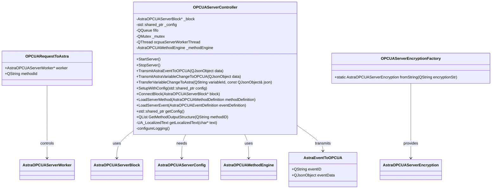

[↩️](#main-classes)

---

### OPCUA Utils

##### Class diagram OPCUA Utils

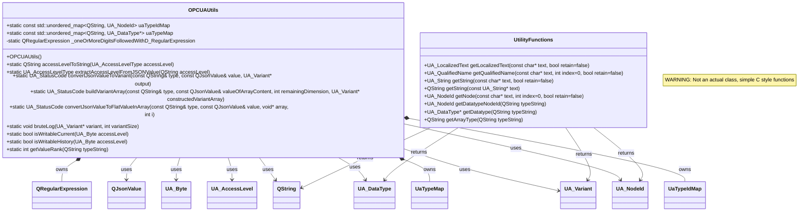

> 📝📝📝 Move Utility functions to class 📝📝📝

[↩️](#main-classes)

---

### Astra Opcua Variable Engine

```graphviz {#id .class width=600px}
digraph AstraOPCUAVariableEngineMethods {

     // Global graph styling
    graph [
        bgcolor="antiquewhite",

        fontsize=12,
        label="AstraOPCUAMethodEngine Method Flows",
        labelloc="t",
        labeljust="c"
    ];

    // Node styling
    node [
        shape=record,
        style=filled,
        fillcolor="skyblue:#0091D7",
        gradientangle=270,
        fontname="Helvetica",
        fontcolor="black",
        color=navyblue
    ];

    // Edge styling
    edge [
        color="#0091D7",
        fontname="Helvetica"
    ];

    rankdir=LR;
    node [shape=rectangle, style=filled, fillcolor=lightblue, fontname="Helvetica", fontsize=12];

    // Methods
    // callbacks are in a heavy state of rework...
    beforeWriteCallback [label="beforeWriteCallback\n(UA_Server*, UA_NodeId*, void*, UA_NodeId*, void*, UA_NumericRange*, UA_DataValue*)"];
    setup [label="setup\n(OPCUAVariableDefinitions, UA_Server*, OPCUAServerController*, AstraOPCUANodeEngine&)"];
    findVariableNode1 [label="findVariableNode\n(QString, int)"];
    findVariableNode2 [label="findVariableNode\n(AstraOpcuaJSONVariable, bool)"];
    addVariable [label="addVariable\n(const AstraOpcuaJSONVariable&, UA_NodeId*)"];


    setup -> findVariableNode2 [label="Calls"];
    setup -> addVariable [label="Calls"];

    findVariableNode2 -> findVariableNode1 [label="Calls"];
    findVariableNode2 -> addVariable [label="May Call"];

    // Styling improvements
    edge [fontname="Helvetica", fontsize=10, color=black, arrowhead=vee];
}


```

<!-- /newpage -->

##### Class diagram Variable Engine

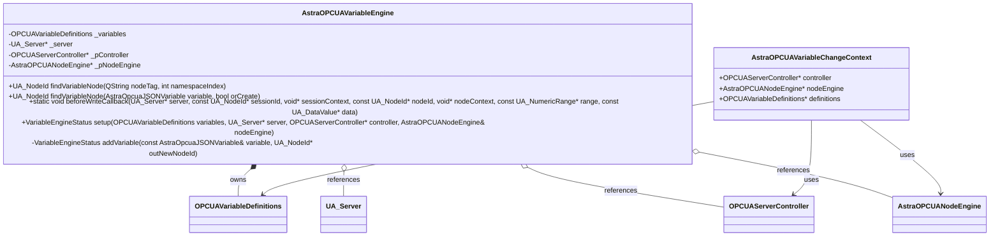

[↩️](#main-classes)

---

### Astra Opcua Method Engine

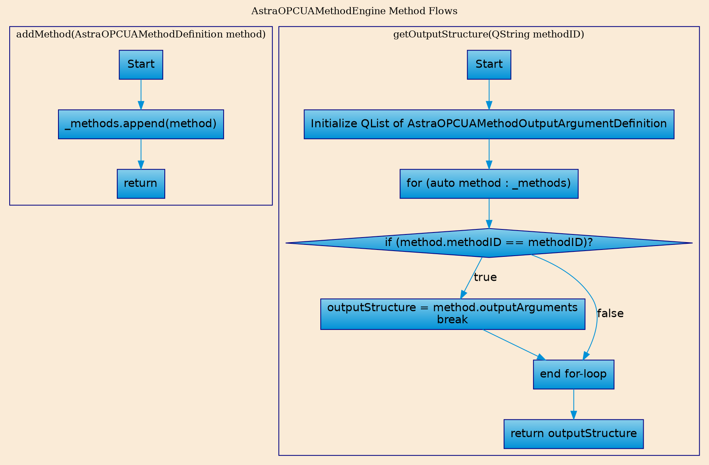

##### Class diagram - Method Engine

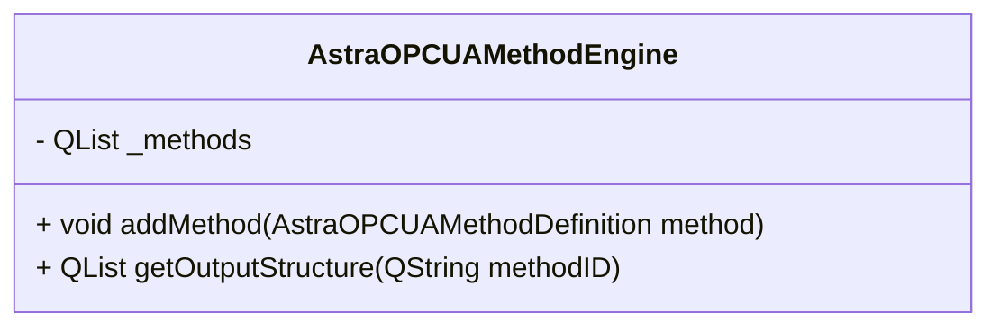

[↩️](#main-classes)

---

### Astra Opcua Node Engine

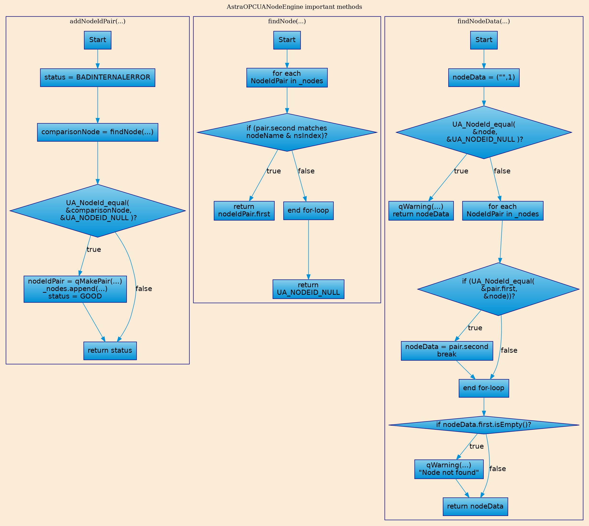

##### Class diagram - Node Engine

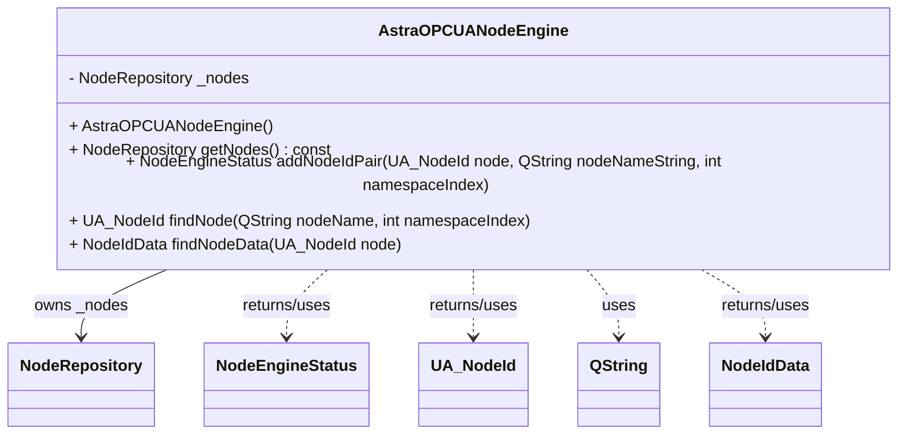

[↩️](#main-classes)

---

### Astra Opcua Bootstrapper

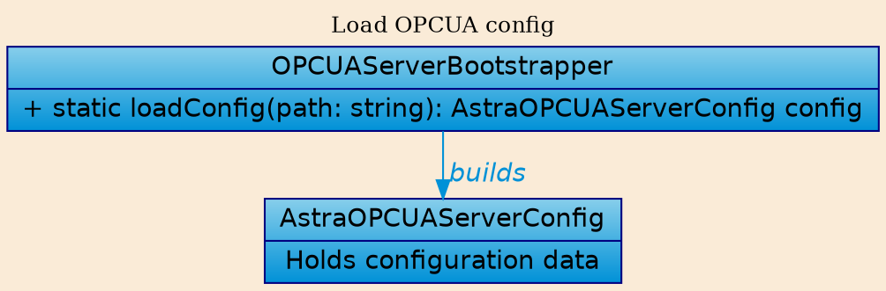

[↩️](#main-classes)

> 💣💣💣 Currently loads the config JSON file 💣💣💣
> 📝📝📝 Move to the Routines and load via astra 📝📝📝

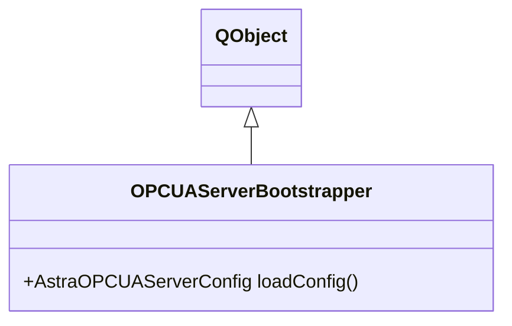

[↩️](#main-classes)

---
